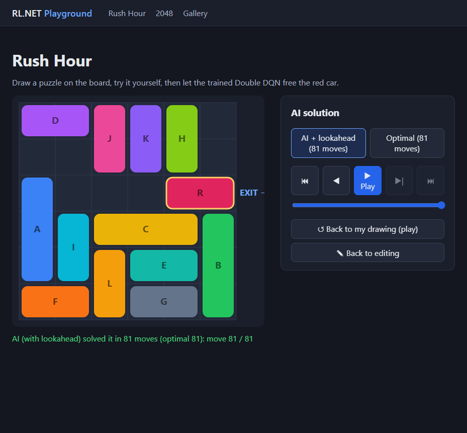
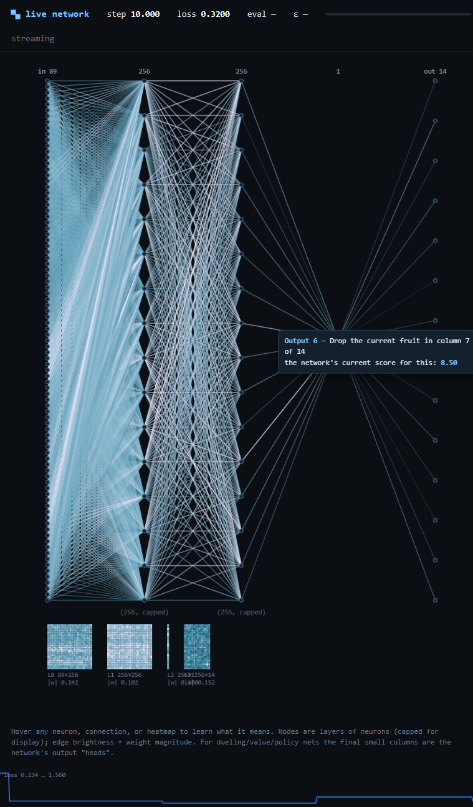
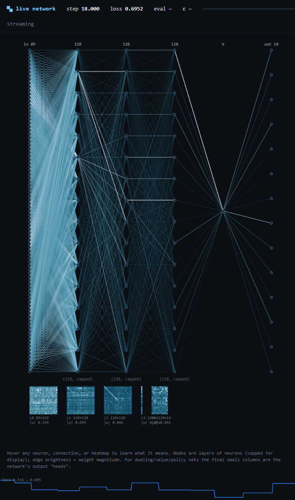

# MintPlayer.AI.ReinforcementLearning

[](https://coverage.mintplayer.com/r/MintPlayer/MintPlayer.AI)


A reinforcement-learning library written from scratch in C#/.NET — no Python, no libtorch,
no native dependencies.

**Contributing? Start with [docs/ARCHITECTURE.md](docs/ARCHITECTURE.md)** — the contributor code map:
where each subsystem lives (Core math/NN/backends, environments, trainers, checkpoints, the web app),
the checkpoint file formats and "Watch AI" wire protocol, how to train/compare models, and a
"where to change things" table for common tasks.

See also:

- [docs/prd/PRD.md](docs/prd/PRD.md) — the why and what
- [docs/prd/PLAN.md](docs/prd/PLAN.md) — the milestone roadmap
- [docs/OPTIMIZATIONS.md](docs/OPTIMIZATIONS.md) — the performance/capability optimization ledger (CPU & GPU compute, residency, training efficiency — done and planned)
- [docs/ADDING_A_GAME.md](docs/ADDING_A_GAME.md) — the end-to-end "add a new game" checklist

## Layout

| Project | Contents |
|---|---|
| `src/MintPlayer.AI.ReinforcementLearning.Core` | Environment API (Gymnasium-faithful), spaces, seeded RNG, agents, trainers, solvers, checkpoints + model store |
| `src/MintPlayer.AI.ReinforcementLearning.Environments` | GridWorld, FrozenLake, CartPole, 2048, Rush Hour (incl. BFS solver + puzzle generator), Rubik's Cube (incl. a C# port of Kociemba's two-phase solver) |
| `src/RLDemo.Console` | Console demo — watch agents learn and play (`--save`/`--load` persist trained models) |
| `src/RLDemo.Web` | **MintPlayer.AI.ReinforcementLearning Playground** — ASP.NET Core + Angular web app: three games (Rush Hour, classic-feel 2048, a 3D Rubik's Cube), each playable yourself and solvable by the trained AI with step-through playback, plus a public gallery of every submitted board |
| `tests/MintPlayer.AI.ReinforcementLearning.Tests` | xUnit suite incl. solved-threshold gates, determinism tests and web API integration tests |
| `tools/MintPlayer.AI.ReinforcementLearning.Lab` | Long-running training campaigns (Rush Hour, Rubik's Cube, Snake, FruitCake) — resumable, checkpointing into the model store. Add `--viz` for a live in-browser **network visualizer** (see below) |

## Run the playground

```
dotnet run --project src/RLDemo.Web
```

Open the printed URL (default `http://localhost:5210`). In Development the host spawns and
proxies the Angular dev server itself — don't run `ng serve` separately. A fresh `data/`
directory seeds itself from the shipped checkpoints in `models/`, so all three games'
AIs are ready immediately; with an empty seed the host trains at startup instead (page
banners show live progress). The strongest Rush Hour and Rubik's Cube solvers (the
imitation policy nets) are trained with `tools/MintPlayer.AI.ReinforcementLearning.Lab`
(see "Train the models" below).

### Docker

```
docker compose -f docker-compose.local.yml up
```

Open `http://localhost:8080`. Models and the public gallery persist on the `rlnet-data`
volume across restarts and upgrades; a fresh volume seeds itself from the shipped
pre-trained checkpoints in `models/`, so the playground is instantly ready.

The root `docker-compose.yml` is the **deployment** variant (Traefik VPS convention):
it pulls the GHCR image and routes `ai.mintplayer.com` through the external `web`
network with Let's Encrypt TLS.

Every push to `master` also publishes the image to GHCR
(`ghcr.io/mintplayer/mintplayer.ai/playground:master`), so running
it without cloning is:

```
docker run -p 8080:8080 -v rlnet-data:/data ghcr.io/mintplayer/mintplayer.ai/playground:master
```

## Run the demo

```
dotnet run --project src/RLDemo.Console -c Release                 # everything, seed 42
dotnet run --project src/RLDemo.Console -c Release -- cartpole     # just the DQN flagship
dotnet run --project src/RLDemo.Console -c Release -- 2048         # n-tuple TD plays 2048
dotnet run --project src/RLDemo.Console -c Release -- grid lake 7  # tabular envs, seed 7
```

Demos (each ends with animated console playback):

- **GridWorld / FrozenLake** — tabular Q-learning, verified exactly against value
  iteration; FrozenLake is Gymnasium-comparable (≥70% success).
- **CartPole-v1** (`cartpole` = Double DQN, `ppo` = PPO over 8 vectorized envs) —
  faithful port, bit-for-bit match against recorded Gymnasium trajectories;
  solved = mean return ≥ 475/500. Both solve in seconds.
- **2048** (`2048` = afterstate TD(0) n-tuple network, `2048dqn` = generic masked
  Double DQN) — reaches the 2048 tile in ~84% of games after ~3 minutes of self-play.
- **Rush Hour** (`rushhour`) — masked Double DQN on a generated 30-puzzle easy set with
  a BFS oracle; solves 100% within 2× optimal after ~1 minute of training.
- **Rubik's Cube** (`cube`) — masked Double DQN on shallow quarter-turn scrambles
  (depths 1–6); with Q-guided lookahead it solves the whole band (600/600) after
  ~65 minutes of training. The Kociemba port doubles as the always-available
  algorithmic solver and the imitation oracle.

The playground's strongest solvers go further with **imitation learning + net-guided
search** (`tools/MintPlayer.AI.ReinforcementLearning.Lab`):

- **Rush Hour** — imitation from the BFS oracle + policy-guided A\*: after an overnight
  run (224M labeled states, pure managed .NET) it solves every official ThinkFun card we
  tested **optimally**, including expert card 40 (81 moves) in ~2,500 node expansions:



- **Rubik's Cube** — imitation from Kociemba solutions + value-guided A\*: after a 2-hour
  campaign (7.7M labeled states) it solves 96% of depth-1–10 scrambles within 40
  quarter-turns; deeper scrambles fail honestly and the Kociemba button always answers.

## Train the models

The web host trains its fallback models automatically when the store is empty. The
imitation policy nets are trained (and resumed — net + Adam state checkpoint to the
model store every eval) by Lab campaigns:

```
dotnet run --project tools/MintPlayer.AI.ReinforcementLearning.Lab -c Release -- --hours N --data src/RLDemo.Web/data           # Rush Hour
dotnet run --project tools/MintPlayer.AI.ReinforcementLearning.Lab -c Release -- --game cube --hours N --data models            # Rubik's Cube (imitation)
dotnet run --project tools/MintPlayer.AI.ReinforcementLearning.Lab -c Release -- --game cube --eval-only --data models          # cube gate report
```

(The cube's stronger *self-taught* value net — `--game cube-davi` — has its own start/resume
instructions below.)

Point `--data` at `src/RLDemo.Web/data` to have the running playground pick up improving
checkpoints live (it re-reads them every few minutes), or at `models/` to refresh the
committed seeds. The DQN fallbacks can be retrained from the console:
`dotnet run --project src/RLDemo.Console -c Release -- rushhour|cube --save --data models`.

### Training flags

Every campaign is launched by `tools/MintPlayer.AI.ReinforcementLearning.Lab` and shares a common set of flags,
plus a few per-game knobs.

**Common (all `--game`s):**

| Flag | Meaning |
|---|---|
| `--game <name>` | `rushhour` (default), `snake`, `fruitcake`, `cube`, `cube-policy`, `cube-davi` |
| `--hours H` | wall-clock training budget |
| `--data DIR` | model-store directory to read/write checkpoints (e.g. `src/RLDemo.Web/data` or `models`) |
| `--seed S` | RNG seed (runs are reproducible) |
| `--lr LR` | learning rate |
| `--eval-only` | evaluate the stored net and exit — no training |
| `--viz [port]` | live [network visualizer](#watch-the-network-train-live-visualizer) (Development only; bare `--viz` = 5250) |
| `--grow` / `--grow-every N` | progressively grow the net wider+deeper (all games **except** `cube-davi`, which grows via `--auto-widen`) |

**Per-game knobs:**

| Game | Flags |
|---|---|
| `snake`, `fruitcake` (DQN) | `--steps N` (absolute step cap), `--chunk-steps N`, `--episodes N` (eval games), `--explore E` (ε-start), `--hidden a,b` (trunk widths), `--gamma G` |
| `snake` (extra) | `--train-grid`, `--eval-grid`, `--step-penalty`, `--safe-mask`; `--search` evaluates the look-ahead planner (with `--depth`/`--beam`/`--w-*`/`--net`) instead of training |
| `fruitcake` (extra) | `--nstep N`, `--shape` (reward shaping), `--noisy` (NoisyNets); offline comparison modes `--ab` (`--baseline`, `--ab-episodes`) and `--search-eval` (`--depth`/`--topk`/`--topk2`/`--leaf`) |
| `cube` (imitation) | `--width W` (trunk width) |
| `cube-policy` (EfficientCube) | `--width W`, `--max-scramble D`, `--beam W`, `--episodes N` |
| `rushhour` (imitation) | common flags only |
| `cube-davi` (self-taught value net) | its own set — see the section below (`--net residual`, `--width`, `--max-depth`, `--samples`, `--auto-widen`, `--grow-to`, and the `--eval-only --search --batched …` measurement mode) |

### Train / further-train the self-taught cube solver (DAVI)

The cube's strongest net is trained *teacher-free* by deep approximate value iteration
(`--game cube-davi`, residual value net) — no Kociemba, just the goal and a cost objective — and
solved by value-guided batch-weighted A\*. The shipped net is already QTM-optimal to depth 15;
pushing the frontier deeper is a longer GPU campaign (net *capacity/coverage*, not width — width
plateaued).

**Start** a campaign (GPU-resident when a CUDA device is present, CPU fallback otherwise):

```
dotnet run --project tools/MintPlayer.AI.ReinforcementLearning.Lab -c Release -- \
  --game cube-davi --net residual --max-depth 26 --probe-depths 12,14,15,16 \
  --hours 12 --data src/RLDemo.Web/data
```

**Resume / further-train** — just run the **same command again**. The campaign checkpoints the net,
Adam state, curriculum depth and sampler RNG to the store every eval, so a re-run *continues* where
it left off (warm-starting from the shipped net) rather than restarting. Add `--samples N` to stop
at a total state count (also resumable across runs); bound a single session with `--hours`. Watch
capability climb in `<data>/logs/cube-davi-res-cap.csv`.

**Measure** deep capability without training (no `--hours`):

```
dotnet run --project tools/MintPlayer.AI.ReinforcementLearning.Lab -c Release -- \
  --game cube-davi --net residual --eval-only --search --batched \
  --weight 1.0 --max-exp 100000 --max-depth 20 --vs-kociemba --data src/RLDemo.Web/data
```

Full recipe + expected single-GPU wall-clock:
[`tools/…/Lab/CUBE_CAMPAIGN.md`](tools/MintPlayer.AI.ReinforcementLearning.Lab/CUBE_CAMPAIGN.md).

## Watch the network train (live visualizer)

Add `--viz` to **any** Lab training run to open a live, in-browser view of the neural network as it learns:

```
dotnet run --project tools/MintPlayer.AI.ReinforcementLearning.Lab -c Release -- --game snake --viz
```

Open the printed URL (default `http://localhost:5250`). The page draws the network as a node-link graph
with per-layer weight heatmaps and a loss sparkline, all repainting live — you watch the weights move
from random init toward a policy. **Hover any neuron, connection, or heatmap** for a plain-language
explanation: each input names the observation feature it is (and its current value), each output the
action it controls (and its live Q-value/score), and hidden neurons show their current activation. Works
for every game — `snake`, `fruitcake`, `rushhour`, `cube`, `cube-policy`, `cube-davi`.



**Watch the net grow, too.** The DQN games can grow their network *wider and deeper* mid-training
(function-preserving Net2WiderNet / Net2DeeperNet). Add `--grow` and watch the graph add units and layers live:

```
dotnet run --project tools/MintPlayer.AI.ReinforcementLearning.Lab -c Release -- --game fruitcake --viz --grow
```

It starts from a tiny net and grows through `[16] → [32] → [32,32] → … → [128,128,128]` with no loss spike (each
step preserves the function exactly). `--grow-every N` sets how many training steps between growth steps — slow it
down (and open the page immediately) to catch every stage from the start:

```
dotnet run --project tools/MintPlayer.AI.ReinforcementLearning.Lab -c Release -- \
  --game fruitcake --viz --grow --grow-every 5000
```

`--grow` works for **every trainable game** — the DQN nets (Snake, FruitCake) and the two-headed imitation policy
nets (`--game cube|rushhour --grow`); the cube's self-taught DAVI value net already grows its width during its
campaign (`--auto-widen`).



It is a **development-only** tool: the socket only starts in a Development host environment (the Lab
defaults to it; set `DOTNET_ENVIRONMENT=Production` to disable) and is never part of the deployed web app.
Telemetry is read-only — a watched run trains bitwise-identically to an unwatched one. Design notes:
[docs/prd/NETWORK_VISUALIZER_PRD.md](docs/prd/NETWORK_VISUALIZER_PRD.md).

## Run the tests

```
dotnet test
```

Statistical solve-threshold tests carry `[Trait("Category", "Slow")]`; filter with
`dotnet test --filter "Category!=Slow"` for the fast loop.
